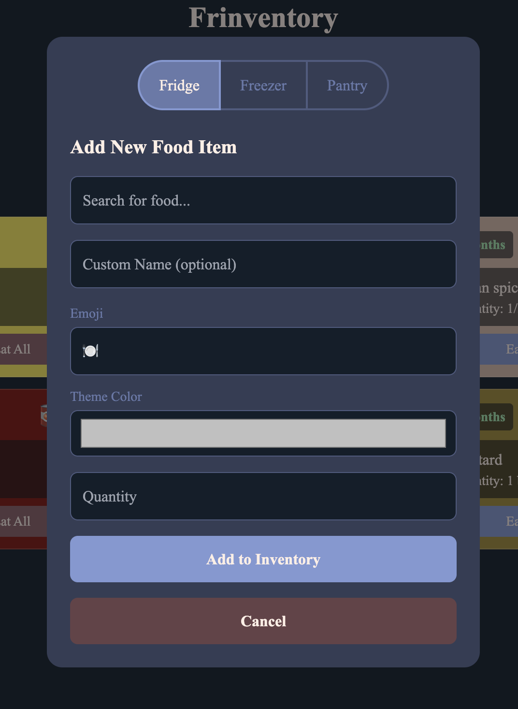
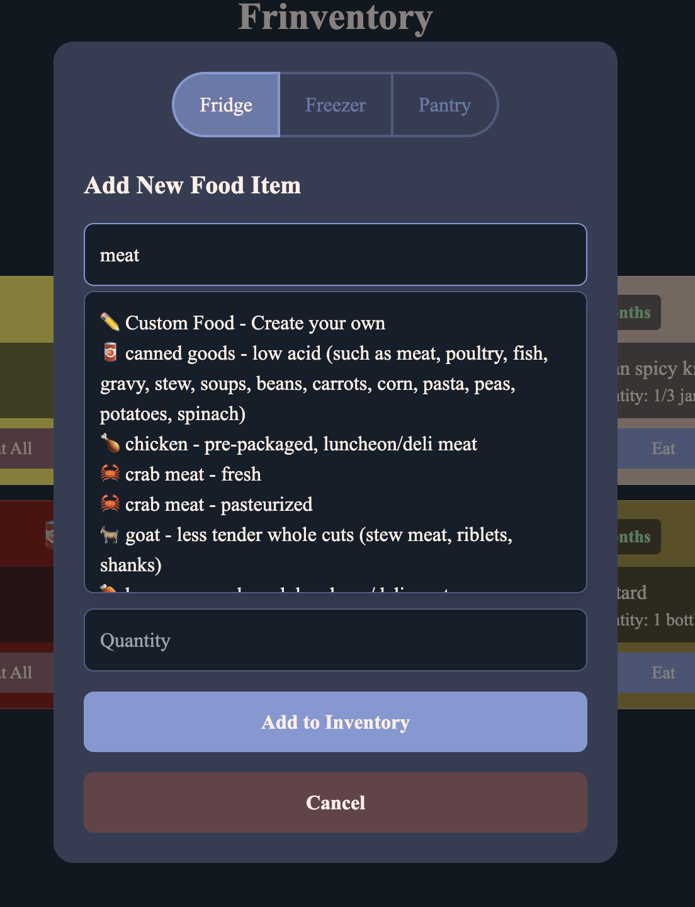
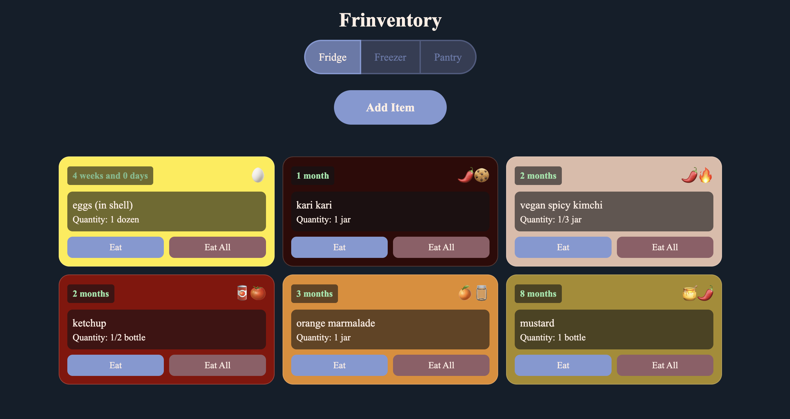
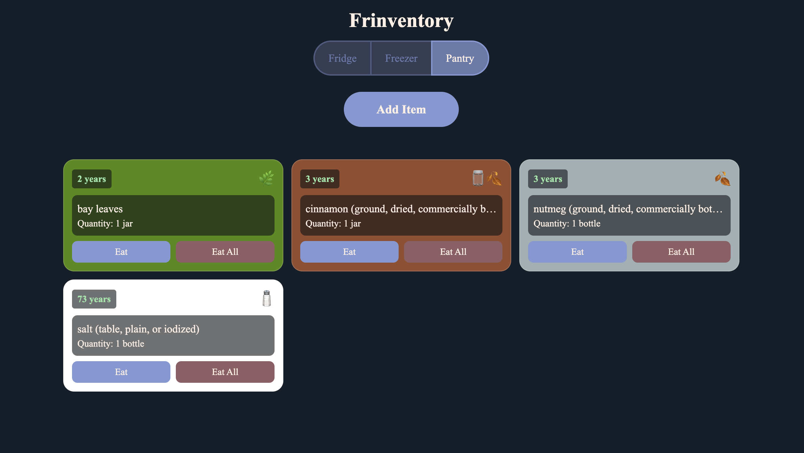

# Frinventory
A fridge inventory management app! It uses the USDA's official guidelines to automatically suggest and track expiration dates of foods across your fridge, pantry, and freezer. It is also designed as a PWA for use on mobile devices to easily and quickly enter new food items.

# Images

## Setup DB
- Local DB: `npx wrangler d1 execute fridge-db --local --file=schema.sql`
- Remote DB: `npx wrangler d1 execute fridge-db --remote --file=schema.sql`

## Test App Locally
- `npm run dev`

## Deploy App
- `npx wrangler deploy`
